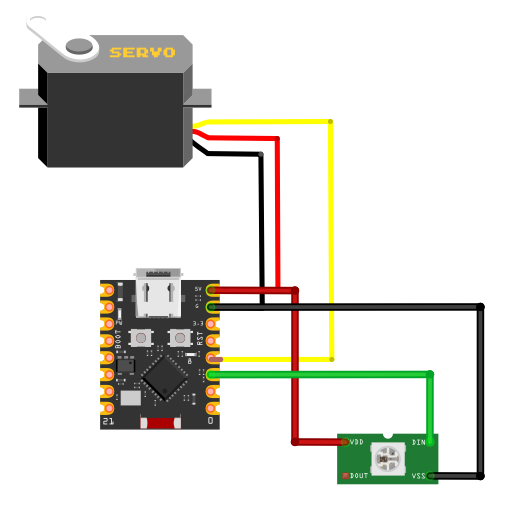

# Spånsug – ESP32-C3 Gate Controller (Kalibrering)

Dette projekt er en **kalibrerings- og test-firmware** til et motorstyret spjæld
(brugt i spånsug-systemet i FabLab Spinderihallerne).

Firmwaren kører på en **ESP32-C3 SuperMini** og bruges til at:

- Kalibrere **servo-positioner** (OPEN / CLOSE)
- Give **visuel status** via en WS2812B LED
- Forberede hardware inden MQTT / backend-logik tilkobles

> ⚠️ Denne version indeholder **ingen MQTT endnu**  
> Den er udelukkende til **mekanisk og elektrisk kalibrering**.

---

## Hardware

- ESP32-C3 SuperMini
- Servo (MG996R / MG966R el.lign.)
- 1× WS2812B (NeoPixel)
- Ekstern 5–6 V strømforsyning til servo
- Fælles GND mellem ESP32 og servo/LED

### Pinout (default)
| Funktion | GPIO |
|-------|------|
| Servo signal | GPIO 3 |
| WS2812B data | GPIO 2 |

*(Kan ændres i koden)*

## Tilslutning (test-setup)

Nedenstående diagram viser test-opstillingen med:
- ESP32-C3 SuperMini  
- Servo til spjæld  
- WS2812B status-LED  

---

## LED-status

| Tilstand | LED |
|--------|-----|
| Spjæld åben | 🟢 Grøn |
| Spjæld lukket | 🔴 Rød |
| Ukendt / init | Slukket |

---

## Sådan bruges kalibreringskoden

### 1. Flash firmwaren
Brug **VS Code + PlatformIO** til at bygge og uploade projektet.

### 2. Åbn Serial Monitor
- Baud rate: **115200**
- PlatformIO: `Ctrl + Alt + S`

### 3. Tast kommandoer
Skriv ét tegn ad gangen og tryk Enter:

| Tast | Funktion |
|----|---------|
| `o` | Gå til OPEN-position |
| `c` | Gå til CLOSE-position |
| `+` | Øg OPEN-vinkel |
| `-` | Sænk OPEN-vinkel |
| `,` | Øg CLOSE-vinkel |
| `.` | Sænk CLOSE-vinkel |
| `p` | Print aktuelle værdier |

Kalibrér indtil:
- Spjældet lukker helt tæt **uden at servoen presser**
- Spjældet åbner helt **uden at ramme mekanisk stop**

---

## Vigtige noter

- Brug altid **fælles GND**
- Hvis servoen “brummer” i endestop → justér 2–5 grader tilbage
- mosquitto_sub -h 127.0.0.1 -t "spansug/gate/rondelsliber/#" -v (For at se hvad ESP32 sender)
- mosquitto_pub -h 127.0.0.1 -t "spansug/gate/rondelsliber/cmd" -m "OPEN" (Kommando til manuel åbning)
- mosquitto_pub -h 127.0.0.1 -t "spansug/gate/rondelsliber/cmd" -m "CLOSE" (Kommando til manuel lukning)

---

## Projektstatus

- [x] Servo-kalibrering
- [x] Visuel status (WS2812B)
- [ ] MQTT (OPEN / CLOSE kommandoer)
- [ ] Machine_active input (strømsensor / afbryder)
- [ ] Endelig gate-controller firmware

---

## Næste skridt

Denne kode bruges som grundlag for næste version, hvor ESP32’en:

- Sender `machine_active` via MQTT
- Modtager `OPEN` / `CLOSE` kommandoer fra backend
- Indgår i et samlet spånsug-styringssystem

---

FabLab Spinderihallerne  
Vejle

