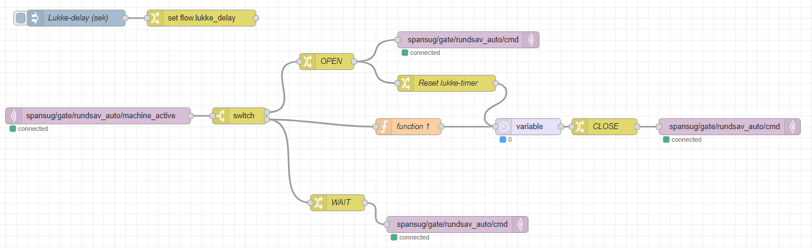
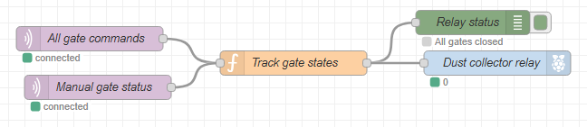

# Spånsug – Gate Controller (ESP32-C3) + Node-RED backend

Denne mappe indeholder **Node-RED-flowene**, som fungerer som den centrale styringslogik
for motoriserede spjæld (gates) i spånsugssystemet i **FabLab Spinderihallerne (Vejle)**.

## 8 Flows som arbetar sammen

**Automatiske gates (med servo-kontrol):**
- `spansug-gate-rundsav.json` – Rundsav (automatisk åbning ved maskinstatus)
- `spansug-gate-stor_cnc.json` – Stor CNC (automatisk åbning ved maskinstatus)
- `spansug-gate-lille_cnc.json` – Lille CNC (automatisk åbning ved maskinstatus)
- `spansug-gate-disponibel_1.json` – Disponibel 1 (automatisk åbning ved maskinstatus)
- `spansug-gate-disponibel_2.json` – Disponibel 2 (automatisk åbning ved maskinstatus)
- `spansug-gate-rondelsliber.json` – Rondelsliber (automatisk åbning ved maskinstatus)
- `spansug-gate-baandsliber.json` – Båndsliber (automatisk åbning ved maskinstatus)

**KRITISK – Central relay manager:**
- `spansug-relay-manager.json` – **Sikrer at kun ét relæ styrer spånsugmotoren**

**Diagnose flows:**
- `spansug-gate-status-leds.json` – Styrer alle status-LED'er på Raspberry Pi
- `spansug-emergency-stop.json` – Emergency Stop knap med gate auto-luk
- `spansug-led-test.json` – Test flow til at teste alle LED'er på én gang

---

## Arkitektur (overblik)

```
[ Maskine 1 ]     [ Maskine 2 ]     [ Maskine 3 ]
    │                 │                 │
    ▼                 ▼                 ▼
[ ESP32-gate1 ]   [ ESP32-gate2 ]   [ ESP32-gate3 ]
    │                 │                 │
    └─────────────────┼─────────────────┘
                      │
                    MQTT
                      │
                      ▼
          [ Raspberry Pi Node-RED ]
                      │
          ┌───────────┼───────────┐
          ▼           ▼           ▼
       Gate1        Gate2    Relay Manager
       Flow         Flow     Flow (KRITISK)
          │           │           │
          └───────────┼───────────┘
                      │
                      ▼
             [ GPIO 12 Relay ]
            (Spånsuger motor)
```

**Princip:**
- ESP32 er "muskel + I/O" (servo, LED, input)
- Node-RED er "hjernen" (logik, timing, koordinering)
- **Relay Manager** sikrer at kun ét relæ styrer spånsuger-motoren
  - Tæller hvor mange gates der er åbne
  - Holder relæen TIL så længe mindst ét gate er åbent
  - Slukker relæen først når ALLE gates er lukkede

---

## Automatiske Gates (rundsav, disponibel_1, disponibel_2, stor_cnc, lille_cnc, rondelsliber, baandsliber)

### Flow-visualisering



**Input:**
- `spansug/gate/[gatename]/machine_active` – maskinstatus fra ESP32 eller Raspberry Pi sensorer
  - `1` = maskinen kører / sensoren aktiv
  - `0` = maskinen stoppet / sensoren inaktiv

**Output:**
- `spansug/gate/[gatename]/cmd` – kommandoer til ESP32
  - `OPEN` = åbn gate (servo bevæger sig)
  - `WAIT` = ventefase / efterløb (blinkende LED)
  - `CLOSE` = luk gate
- `spansug/gate/[gatename]/status` – rapporterer nuværende tilstand

### Workflow

1. **Maskinen bliver aktiv** (`machine_active = 1`)
   - Sendes `OPEN` med det samme
   - Gate åbner, LED lyser grønt

2. **Maskinen stopper** (`machine_active = 0`)
   - Sendes `WAIT` med det samme
   - Timer starter (standard 30 sekunder, kan konfigureres)
   - Gate forbliver åbent, LED blinker grønt

3. **Timer udløber**
   - Sendes `CLOSE`
   - Gate lukker, LED lyser rødt

4. **Maskinen starter igen inden timer udløber**
   - Timer annulleres
   - Sendes `OPEN` igen (ingen uønsket luk-cyklus)

### Variabler pr. gate

Hver gate bruger disse **flow-variabler** (eksempel: disponibel_1):

```
flow.lukke_delay = 30  (sekunder) – afterrun delay før gate lukkes
```

---


---

## RELAY MANAGER (spansug-relay-manager.json) – KRITISK!

### Flowdiagram



### Problemstilling

**Hvis hver gate havde sit eget relæ-output:**

Scenario der går galt:
1. stor_cnc åbner → slår relæen TIL
2. rundsav_auto åbner 1 minut senere → relæen forbliver TIL
3. stor_cnc lukker → sendes kommando til at slukke relæen
4. **Problem:** Relæen slukkes selv om rundsav_auto stadig er åbent!
5. Spånsuger stopper mens rundsav_auto stadig jobber ❌

### Løsning – Central Relay Manager

**En enkelt flow styrer relæen baseret på status fra ALLE gates:**

```
Flow sammenligner alle gate-statuser:
  IF  gate1 == "ÅBEN" OR gate2 == "ÅBEN" OR gate3 == "ÅBEN" OR manual == "ÅBEN"
  THEN relæ = ON
  ELSE relæ = OFF
```

### Relay Manager Flow – Funktionalitet

**Subscriber på:**
- `spansug/gate/+/cmd` – alle gate-kommandoer
- `spansug/gate/+/status` – alle gate-status updates

**Logik (function node):**
```javascript
// Tæl hvor mange gates der er åbne
let openCount = 0;
let gateStates = flow.get("gateStates") || {};

// Opdater gate-status fra besked
gateStates[msg.topic.split("/")[2]] = msg.payload;
flow.set("gateStates", gateStates);

// Tæl åbne gates
Object.values(gateStates).forEach(state => {
  if (state === "ÅBEN" || state === "OPEN") openCount++;
});

// Bestem relæ-status
msg.relay = openCount > 0 ? "ON" : "OFF";
node.send(msg);
```

**GPIO Output (node 23):**
- PIN 12 = Relay
- Når msg.relay == "ON" → Pin går HIGH
- Når msg.relay == "OFF" → Pin går LOW

**Debug output:**
- Viser hver gang relæen skifter tilstand
- Viser antal åbne gates
- Viser hvilke gates der er åbne

### Test af Relay Manager

**Scenario 1: Enkelt gate åbner**
- stor_cnc sender "OPEN"
- Relay Manager tæller: 1 åbent gate
- Relæ = ON ✓
- Spånsuger starter ✓

**Scenario 2: Andet gate åbner mens første er åbent**
- rundsav_auto sender "OPEN"
- Relay Manager tæller: 2 åbne gates
- Relæ forbliver ON (ikke påvirket af skift) ✓

**Scenario 3: Første gate lukker, anden stadig åben**
- stor_cnc sender "CLOSE"
- Relay Manager tæller: 1 åbent gate (rundsav_auto)
- Relæ forbliver ON ✓
- Spånsuger fortsætter uden afbrydelse ✓

**Scenario 4: Alle gates lukker**
- rundsav_auto sender "CLOSE"
- Relay Manager tæller: 0 åbne gates
- Relæ = OFF ✓
- Spånsuger stopper ✓

---

## MQTT Topics Overview

### Alle gates følger samme topic-struktur

Eksempel for `rundsav_auto`:

**ESP32 → Node-RED:**
```
spansug/gate/rundsav_auto/machine_active
Payload: 1 eller 0
```

**Node-RED → ESP32:**
```
spansug/gate/rundsav_auto/cmd
Payload: OPEN, WAIT, eller CLOSE
```

**Status (fra Node-RED):**
```
spansug/gate/rundsav_auto/status
Payload: ÅBEN eller LUKKET
```

### Alle gate-navne (8 parallelle gates)

- `rundsav`
- `disponibel_1`
- `disponibel_2`
- `stor_cnc`
- `lille_cnc`
- `rondelsliber`
- `baandsliber`

---

## GPIO Konfiguration

| Funktion              | GPIO | Type    | Beskrivelse                                    |
| -------------------- | ---- | ------- | ---------------------------------------------- |
| Position sensor       | 23   | INPUT   | Rundsav manuel gate position (1=åben, 0=lukket) |
| Spånsuger relæ        | 12   | OUTPUT  | Styret af Relay Manager (KRITISK SHARED)       |

> **VIGTIG:** GPIO 12 (relæ) styres UDELUKKENDE af Relay Manager flow!

---

## Manuel MQTT-test (køres på Raspberry Pi)

**Se al trafik for en gate:**
```bash
mosquitto_sub -h 127.0.0.1 -t "spansug/gate/rundsav_auto/#" -v
```

**Se alle gates:**
```bash
mosquitto_sub -h 127.0.0.1 -t "spansug/gate/+" -v
```

**Send kommandoer manuelt:**
```bash
# Åbn gate
mosquitto_pub -h 127.0.0.1 -t "spansug/gate/rundsav_auto/cmd" -m "OPEN"

# Ventefase
mosquitto_pub -h 127.0.0.1 -t "spansug/gate/rundsav_auto/cmd" -m "WAIT"

# Luk gate
mosquitto_pub -h 127.0.0.1 -t "spansug/gate/rundsav_auto/cmd" -m "CLOSE"
```

**Test relay manager:**
```bash
# Watch relay status
mosquitto_sub -h 127.0.0.1 -t "spansug/relay/#" -v

# Watch all gates + relay
mosquitto_sub -h 127.0.0.1 -t "spansug/#" -v
```

---

## Import/Export af Node-RED Flows

### Import (fra JSON-fil)

1. Node-RED → menu (≡) → **Import**
2. Vælg JSON-fil fra denne mappe
3. Klik **Import**
4. Klik **Deploy**

**Rækkefølge (vigtig):**
1. Importer først `spansug-relay-manager.json`
2. Importer derefter alle 4 gate-flows

### Export (gem flow som fil)

1. Node-RED → menu (≡) → **Export**
2. Vælg *Current flow* eller *Selected nodes*
3. Klik **Download**
4. Gem som `.json` fil i denne mappe

---

## Node-RED konfiguration (Mosquitto)

Flows forventer MQTT broker på **lokal Raspberry Pi:**

- Broker: `127.0.0.1` (localhost)
- Port: `1883`
- Username: (tom)
- Password: (tom)

**Tjek at Mosquitto kører:**
```bash
sudo ss -lntp | grep 1883
```

**Start Mosquitto hvis det ikke kører:**
```bash
sudo systemctl start mosquitto
sudo systemctl enable mosquitto  # Auto-start ved opstart
```

---

## Debugging og Troubleshooting

### Relay Manager ikke aktiveret?

**Symptom:** Spånsuger starter ikke når gate åbner.

**Tjekpunkter:**
1. Er Relay Manager flow startet? (Deploy Status grønt?)
2. Søg "Debug" node i Relay Manager for at se gate-status
3. Tjek GPIO 12 med multimeter (skal være HIGH når gate åbent)

### Gate sendes OPEN men servo bevæger sig ikke?

**Symptom:** Relay Manager viser gate åbent, men servo reagerer ikke.

**Tjekpunkter:**
1. Er ESP32 tændt og koblet til WiFi?
2. Tjek ESP32 seriel-output (se `src/main.cpp`)
3. Tjek at ESP32 abonnerer korrekt på `spansug/gate/[gatename]/cmd`

### Relay Manager tæller forkert?

**Symptom:** Spånsuger slukkes selvom gate stadig er åbent.

**Tjekpunkter:**
1. Åbn Debug node i Relay Manager
2. Aktivér alle gates en efter en
3. Tjek at gate-status bliver opdateret korrekt
4. Tjek at count er korrekt (bør være antal åbne gates)

### MQTT forbindelse mistet?

**Symptom:** Flows viser rødt – MQTT connect fejler.

**Tjekpunkter:**
```bash
# Test MQTT forbindelse
mosquitto_pub -h 127.0.0.1 -t "test" -m "hej"

# Se om der er firewall problemer
sudo iptables -L | grep 1883
```

---

## GPIO Oversigt – Raspberry Pi

**Status-LED'er for maskinernes gate-status:**

| GPIO Pin | Maskine | LED Farve | Funktion |
|----------|---------|-----------|----------|
| **GPIO 21** | Rundsav | Grøn | Gate status indikator |
| **GPIO 26** | Disponibel 1 | Grøn | Gate status indikator |
| **GPIO 16** | Lille CNC | Grøn | Gate status indikator |
| **GPIO 13** | Stor CNC | Grøn | Gate status indikator |
| **GPIO 19** | Rondelsliber | Grøn | Gate status indikator |
| **GPIO 6** | Båndsliber | Grøn | Gate status indikator |
| **GPIO 11** | Disponibel 2 | OUTPUT | Gate status indikator |
| **GPIO 12** | Vacuum | Grøn | Udsugning aktiv |

**Styring-GPIO'er:**

| GPIO Pin | Enhed | Type | Funktion |
|----------|-------|------|----------|
| **GPIO 18** | Relay | OUTPUT | Spånsuger motor (KRITISK) |
| **GPIO 23** | Button | INPUT (pull-up) | Emergency Stop knap |
| **GPIO 22** | Status LED | OUTPUT | Emergency Stop indikator |


---

## Blokdiagram – GPIO Tilslutninger

```
                                J8
                               .___.              
                      +3V3---1-|O O|--2--+5V
              (SDA)  GPIO2---3-|O O|--4--+5V
             (SCL1)  GPIO3---5-|O O|--6--_GND
        (GPIO_GLCK)  GPIO4---7-|O O|--8-----GPIO14 (TXD0)
                       GND_--9-|O.O|-10-----GPIO15 (RXD0)
        (GPIO_GEN0) GPIO17--11-|O O|-12-----GPIO18 (🔵 Relay)
        (GPIO_GEN2) GPIO27--13-|O O|-14--_GND
    (🟢 E-Stop LED) GPIO22--15-|O O|-16-----GPIO23 (🔴 E-Stop Button)
                      +3V3--17-|O O|-18-----GPIO24 (GPIO_GEN5)
         (SPI_MOSI) GPIO10--19-|O.O|-20--_GND
         (SPI_MISO) GPIO9 --21-|O O|-22-----GPIO25 (GPIO_GEN6)
  (🟢 Disponibel 2) GPIO11--23-|O O|-24-----GPIO8  (SPI_C0_N)
                       GND_-25-|O O|-26-----GPIO7  (SPI_C1_N)
              (Can't use)---27-|O O|-28-----ID_SC Reserved for ID EEPROM
                    GPIO5---29-|O.O|-30--_
    (🟢 Båndsliber) GPIO6 --31-|O O|-32-----GPIO12 (🟢 Vacuum LED)
    (🟢 Stor CNC L) GPIO13--33-|O O|-34--_GND
    (🟢 Rondelslib) GPIO19--35-|O O|-36-----GPIO16 (🟢 Lille CNC LED)
  (🟢 Disponibel 1) GPIO26--37-|O O|-38-----GPIO20
                          _-39-|O O|-40-----GPIO21 (🟢 Rundsav LED)
                               '---'
                       40W 0.1" PIN HDR
```

**Røde markerede pins (🔴) Input (Trykkontakt)**
**Røde markerede pins (🟢) Output (LED)**
**Røde markerede pins (🔵) Ekstern enhed (Relæ)**

| Pin | GPIO | Funktion |
|-----|------|----------|
| 12  | 18   | Spånsuger Relay (KRITISK) |
| 16  | 23   | Emergency Stop Button |
| 15  | 22   | Emergency Stop LED |
| 23  | 11   | Disponibel 2 |
| 32  | 12   | Vacuum LED |
| 36  | 16   | Lille CNC LED |
| 40  | 21   | Rundsav LED |
| 35  | 19   | Rondelsliber LED |
| 33  | 13   | Stor CNC LED |
| 31  | 6    | Båndsliber LED |
| 37  | 26   | Disponibel 1 |

**Ledige pins:**
- GPIO 2, 3 – I2C (SDA/SCL) – reserveret
- GPIO 4 – GPIO_GLCK – reserveret
- GPIO 5, 7, 8, 9, 10, 14, 15, 17, 20, 24, 25, 27 – Ledige til fremtidigt brug

---

## Tjekliste – LED Tilslutninger

Denne liste kan bruges til at verificere at alle LED'er er tilsluttet korrekt:

```
□ GPIO 21 (Rundsav)       – LED tændt når gate åbent?
□ GPIO 26 (Disponibel 1)  – LED tændt når gate åbent?
□ GPIO 11 (Disponibel 2)  – LED tændt når gate åbent?
□ GPIO 16 (Lille CNC)     – LED tændt når gate åbent?
□ GPIO 13 (Stor CNC)      – LED tændt når gate åbent?
□ GPIO 19 (Rondelsliber)  – LED tændt når gate åbent?
□ GPIO 6  (Båndsliber)    – LED tændt når gate åbent?
□ GPIO 12 (Vacuum)        – LED tændt når vacuum kører?
□ GPIO 18 (Relay)         – Relay klikker når gate åbent?
□ GPIO 23 (E-Stop)        – Knap registreres i Node-RED?
□ GPIO 22 (E-Stop LED)    – LED blinker ved tryk?
□ GPIO 11 (Sensor)        – Sensor rapporterer korrekt position?
```

**Tip:** Brug `spansug-led-test.json` flowet til at teste alle LED'er på én gang!

---

## Status

- [x] 3× automatiske gate-flows (rundsav_auto, stor_cnc, lille_cnc)
- [x] 1× manual gate-flow (rundsav_manual)
- [x] Central Relay Manager (løser multi-gate relay problem)
- [x] Blinkende LED i ventefase (WAIT)
- [x] Efterløbstid via Node-RED (konfigurerbar pr. gate)
- [x] MQTT-baseret kommunikation
- [x] LED-test flow til fejlfinding
- [ ] Strømsensor / CT clamp integration
- [ ] Webinterface for manuel gate-kontrol
- [ ] Datalogging af gate-åbninger

---

## Noter

* Projektet er designet til **værkstedsbrug**
* **KRITISK:** Relay Manager skal aldrig slukkes eller deaktiveres
* Robusthed prioriteres over kompleksitet
* ESP32 holdes bevidst enkel
* Al beslutningslogik samles centralt i Node-RED

---

FabLab Spinderihallerne · Vejle
