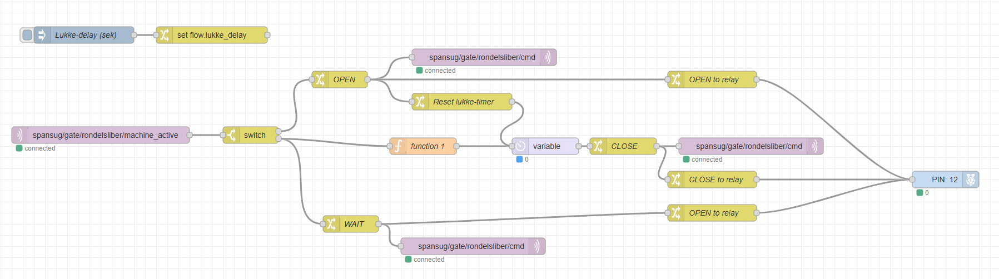

# Spånsug – Gate Controller (ESP32‑C3) + Node‑RED backend

Denne mappe indeholder **Node‑RED‑flowet**, som fungerer som den centrale styringslogik
for motoriserede spjæld (gates) i spånsugssystemet i **FabLab Spinderihallerne (Vejle)**.

Flowet kommunikerer med ESP32‑C3‑baserede gates via **MQTT** og håndterer:

* åbning af spjæld
* ventefase / efterløb
* lukning af spjæld

---

## Arkitektur (overblik)

```
[ Maskine ]
    │
    ▼
[ ESP32‑C3 gate ]  --MQTT-->  [ Raspberry Pi (Mosquitto + Node‑RED) ]
    ▲                               │
    └----------MQTT cmd-------------┘
```



**Princip:**

* ESP32 er “muskel + I/O” (servo, LED, input)
* Node‑RED er “hjernen” (logik, timing, koordinering)
### Flow-visualisering

Billedet ovenfor viser Node‑RED flowet med:

- **Input:** `machine_active` MQTT topic fra maskinetilstandssensor
- **Switch node:** Distribuerer logik baseret på maskinstatus (1 = aktiv, 0 = inaktiv)
- **OPEN / WAIT / CLOSE nodes:** Sender kommandoer via MQTT til gate
- **Lukke-delay:** Venter N sekunder før `CLOSE` sendes (kan konfigureres)
- **Output:** Publiserer kommandoer på `spansug/gate/rondelsliber/cmd`

**Workflow:**
1. Maskinen bliver aktiv → `OPEN` sendes med det samme
2. Maskinen stopper → `WAIT` sendes, timer starter
3. Efter timer-interval → `CLOSE` sendes automatisk
4. Hvis maskinen starter igen inden timeren løber ud, afbrydes lukningen
---

## MQTT topics (eksempel: rondelsliber)

### Fra ESP32 → backend

**Topic**

```
spansug/gate/rondelsliber/machine_active
```

**Payload**

* `1` → maskinen kører
* `0` → maskinen stoppet

---

### Fra backend → ESP32

**Topic**

```
spansug/gate/rondelsliber/cmd
```

**Payload**

* `OPEN`  – åbn spjæld (servo bevæger sig)
* `WAIT`  – ventefase / efterløb (ingen servo, LED blinker grønt)
* `CLOSE` – luk spjæld

---

## Node‑RED flow – funktionel beskrivelse

Flowet reagerer udelukkende på ændringer i `machine_active`.

### 1. Maskinen starter

Når:

```
machine_active = 1
```

Node‑RED gør følgende:

* sender `OPEN` **med det samme** til ESP32
* nulstiller evt. aktiv lukke‑timer

Resultat:

* spjæld åbner
* LED lyser **grønt (fast)**

---

### 2. Maskinen stopper (ventefase)

Når:

```
machine_active = 0
```

Node‑RED gør følgende:

1. sender `WAIT` **med det samme**
2. starter en timer med efterløbstid

Resultat:

* spjæld forbliver åbent
* LED **blinker grønt** under hele ventefasen

---

### 3. Efterløbstid udløber

Når timeren udløber:

* Node‑RED sender `CLOSE`

Resultat:

* spjæld lukker
* LED lyser **rødt (fast)**

---

### 4. Maskinen starter igen før timeren udløber

Hvis:

```
machine_active = 1
```

inden efterløbstiden er gået

Node‑RED:

* annullerer lukke‑timeren
* sender `OPEN`

Resultat:

* spjæld forbliver åbent
* ingen unødvendig åbne/lukke‑cyklus

---

## Variabler

Flowet bruger følgende **flow‑variabel**:

```
flow.lukke_delay
```

* Enhed: **sekunder**
* Bruges som efterløbstid
* Kan ændres ét sted uden at ændre selve flow‑logikken

---

## Manuel MQTT‑test (køres på Raspberry Pi)

**Se al trafik for en gate**

```bash
mosquitto_sub -h 127.0.0.1 -t "spansug/gate/rondelsliber/#" -v
```

**Send kommandoer manuelt**

```bash
# Åbn
mosquitto_pub -h 127.0.0.1 -t "spansug/gate/rondelsliber/cmd" -m "OPEN"

# Ventefase (blink)
mosquitto_pub -h 127.0.0.1 -t "spansug/gate/rondelsliber/cmd" -m "WAIT"

# Luk
mosquitto_pub -h 127.0.0.1 -t "spansug/gate/rondelsliber/cmd" -m "CLOSE"
```

---

## Import / Export af Node‑RED flow

### Export (gem flow som fil)

Node‑RED → menu (≡) → **Export** → vælg *Current flow* (eller *Selected nodes*) → **Download (JSON)**

### Import

Node‑RED → menu (≡) → **Import** → vælg JSON‑fil → **Import** → **Deploy**

---

## Raspberry Pi / Mosquitto (LAN)

MQTT broker kører på Raspberry Pi:

* IP (eksempel): `192.168.87.133`
* Port: `1883`

Tjek broker:

```bash
sudo ss -lntp | grep 1883
```

---

## Status

* [x] MQTT‑baseret gate‑styring
* [x] OPEN / WAIT / CLOSE‑model
* [x] Blinkende LED i ventefase
* [x] Efterløbstid via Node‑RED
* [ ] CT clamp / strømsensor
* [ ] Generisk flow til alle gates
* [ ] Master‑logik for spånsuger

---

FabLab Spinderihallerne · Vejle
