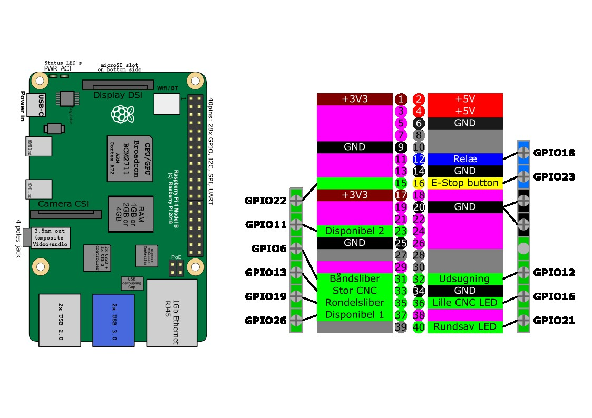

## Blokdiagram – GPIO Tilslutninger

| Pin Number | Function  |
|------------|-----------|
| 1          | 3.3V     |
| 2          | 5V       |
| 3          | GPIO 2   |
| 4          | 5V       |
| 5          | GPIO 3   |
| 6          | GND      |
| 7          | GPIO 4   |
| 8          | GPIO 14  |
| 9          | GND      |
| 10         | GPIO 15  |
| 11         | GPIO 17  |
| 12         | GPIO 18  |
| 13         | GPIO 27  |
| 14         | GND      |
| 15         | GPIO 22  |
| 16         | GPIO 23  |
| 17         | 3.3V     |
| 18         | GPIO 24  |
| 19         | GPIO 10  |
| 20         | GND      |
| 21         | GPIO 9   |
| 22         | GPIO 25  |
| 23         | GPIO 11  |
| 24         | GPIO 8   |
| 25         | GND      |
| 26         | GPIO 7   |
