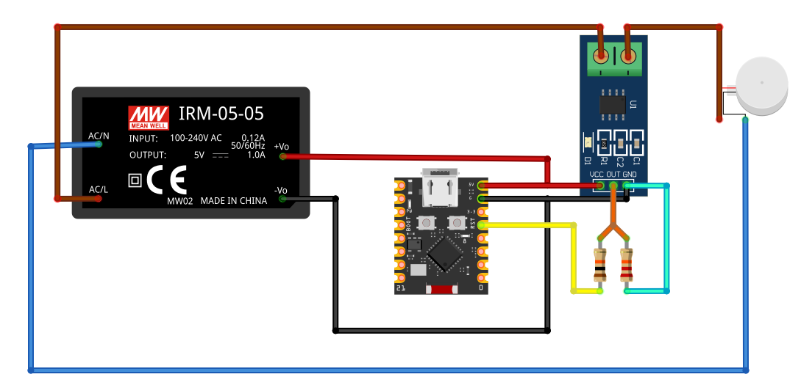

# Current Sensor - ZMCT103C Strømmåler

Automatisk gate-aktivering baseret på strømforbrug til maskiner i FabLab Spinderihallerne.

## 📋 Oversigt

Dette system måler strømforbruget til en maskine (f.eks. rondelsliber) og sender automatisk MQTT kommandoer til Node-RED for at åbne/lukke det tilhørende spånsuger-spjæld.

**Princip:**
1. Strømsensor måler kontinuerligt maskines strømforbrug
2. Når strøm > baseline + hysteresis → Send `"1"` til MQTT
3. Node-RED modtager besked og åbner gate
4. Når strøm < baseline → Send `"0"` til MQTT
5. Node-RED lukker gate

**Ingen manuel betjening påkrævet!** ✅

---

## ⚡ Hardware

### Komponenter
- **ESP32-C3 Super Mini**
- **ZMCT103C Current Transformer Module** (5A max, 1000:1 ratio)
- **Voltage Divider** (R1=10kΩ, R2=20kΩ) - beskytter ESP32 GPIO
- 5V strømforsyning til ZMCT103C modul

### Tilslutninger

```
ZMCT103C Module:
├── VCC → 5V power supply
├── GND (×2) → ESP32 GND (short begge GND pins sammen)
└── Signal Out → [Voltage Divider] → ESP32 GPIO 4

Voltage Divider (5V → 3.3V):
┌─── ZMCT103C Signal Out
│
├─── R1 (10kΩ) ───┬─── ESP32 GPIO 4 (ADC)
│                 │
└─── R2 (20kΩ) ───┴─── GND

AC Wire Path:
Netspænding (230V) → Strømførende ledning gennem ZMCT103C "donut"
```

### ZMCT103C Specifikationer
- Current Ratio: 5A:5mA (1000:1)
- Rated Primary Current: 5A @ 50/60Hz
- Isolation Voltage: 4500V
- Operating Temperature: -40°C til +85°C
- Indbygget sampling resistor og precision op-amp
- Justerbar forstærkning via onboard potentiometer

### Komplet Opstilling



*Diagram viser alle komponenter og forbindelser i current sensor systemet*

---

## 🔧 Konfiguration

### WiFi & MQTT (i koden)

```cpp
// WiFi credentials
const char* ssid = "Fablab";
const char* password = "11223344";

// MQTT Broker
const char* mqtt_broker = "spansug-backend.local";
const int mqtt_port = 1883;

// MQTT Topics (passer til Node-RED flow)
const char* mqtt_topic_status = "spansug/gate/rondelsliber/machine_active";
const char* mqtt_topic_current = "spansug/gate/rondelsliber/current";
```

### Kalibrering

Systemet er kalibreret med:
- **780W boremaskine** → 3.4A måling
- **Calibration Factor: 4.35**

```cpp
float calibrationFactor = 4.35;  // Pre-kalibreret
```

### Baseline via Web Interface

Tilgå web interface på: **http://currentsensor.local**

- **Tomgang:** ~0.040A
- **Anbefalet baseline:** 0.2A (for 2000W rondelsliber)
- **Hysteresis:** 0.05A (forhindrer flimren)
- **ON trigger:** baseline + hysteresis = 0.25A

Web interfacet gemmer baseline permanent i flash-memory.

---

## 📊 Måleprincip

### RMS Beregning
1. Tag 1000 samples fra ADC
2. Find DC offset (gennemsnit)
3. Beregn RMS med korrekt zero-point
4. Ignorer målinger med <10 ADC counts peak-to-peak (støjreduktion)
5. Kompensér for voltage divider (×1.5)
6. Multiplicér med calibration factor

### State Detection
```
Hysteresis logik:
- Maskine OFF → ON: Når current > (baseline + 0.05A)
- Maskine ON → OFF: Når current < baseline
```

Dette forhindrer "flimren" når strømmen svinger omkring baseline.

---

## 🌐 Web Interface

Tilgængelig på: **http://currentsensor.local**

### Features:
- **Real-time strøm display** (opdateres hvert sekund)
- **Maskinstatus** (ON/OFF med farve)
- **Baseline kalibrering** (sæt og gem permanent)
- **Responsive design** (virker på mobil)

### Kalibrering Workflow:
1. Tilslut maskine i tomgang
2. Observer strømværdi (typisk ~0.04A)
3. Sæt baseline til 5× tomgangsværdi
4. Gem - baseline persistent i flash

---

## 📡 MQTT Integration

### Payload Format

**Topic:** `spansug/gate/rondelsliber/machine_active`

| State | Payload | Node-RED Action |
|-------|---------|----------------|
| ON    | `"1"`   | Åbn gate (OPEN) |
| OFF   | `"0"`   | Luk gate (CLOSE) |

**Topic:** `spansug/gate/rondelsliber/current`
- Sender aktuel strømværdi (float) ved state change

### Node-RED Flow Match

Flowet forventer:
```json
{
  "topic": "spansug/gate/rondelsliber/machine_active",
  "payload": "1"  // eller "0"
}
```

✅ **Verificeret kompatibel** med eksisterende Node-RED flow

---

## 🚀 Installation & Upload

### PlatformIO Environment

```ini
[env:currentsensor]
platform = espressif32
board = esp32-c3-devkitm-1
framework = arduino
monitor_speed = 115200
build_flags = 
    -DARDUINO_USB_MODE=1
    -DARDUINO_USB_CDC_ON_BOOT=1
build_src_filter = +<CurrentSensor/> -<main.cpp> -<Calibration/> -<RemoteSensor/>

lib_deps =
  knolleary/PubSubClient
  Preferences
  esphome/ESPAsyncWebServer-esphome @ ^3.2.2
  esphome/AsyncTCP-esphome @ ^2.1.3
```

### Upload Commands

```bash
# Upload firmware
pio run -e currentsensor --target upload

# Monitor serial output
pio device monitor -e currentsensor
```

---

## 🧪 Test & Verifikation

### Test Setup
1. **Tomgang test:** Ingen belastning → ~0.04A
2. **LED test:** 9.5W LED → ~0.14A (tydeligt signal)
3. **Boremaskine test:** 780W → 3.4A (kalibreringspunkt)

### Forventet Output (Serial Monitor)
```
Connecting to WiFi...
SSID: Fablab
WiFi connected
IP address: 192.168.1.xxx
mDNS started: currentsensor.local
Web server started
Access at: http://192.168.1.xxx
Or at: http://currentsensor.local
ZMCT103C Current Sensor Setup Complete
Attempting MQTT connection...
MQTT connected

Current: 0.045 A | Baseline: 0.200 A | Machine: OFF
Current: 0.040 A | Baseline: 0.200 A | Machine: OFF
Current: 3.420 A | Baseline: 0.200 A | Machine: ON [STATE CHANGED]
```

---

## ⚙️ Avanceret

### Peak-to-Peak Detection
Systemet måler P-P værdi for at filtrere støj:
```cpp
if (peakToPeak < 10) {
    return 0.0;  // No meaningful AC signal
}
```

### Voltage Divider Kompensation
```cpp
const float VOLTAGE_DIVIDER_RATIO = 0.667;  // 20k/(10k+20k)
const float VOLTAGE_COMPENSATION = 1.5;     // 1/0.667
voltage = voltage * VOLTAGE_COMPENSATION;
```

### mDNS Discovery
```cpp
MDNS.begin("currentsensor");  // currentsensor.local
```

---

## 🔍 Troubleshooting

### Problem: Høj støj i målinger
**Løsning:** Juster onboard potentiometer på ZMCT103C modul

### Problem: Forkerte strømværdier
**Løsning:** 
1. Tjek voltage divider modstande (10kΩ og 20kΩ)
2. Justér `calibrationFactor` i koden
3. Test med kendt belastning (f.eks. 780W = 3.4A)

### Problem: Gate åbner/lukker for let
**Løsning:** 
1. Øg baseline via web interface
2. Justér hysteresis (0.05A default)

### Problem: WiFi forbinder ikke
**Løsning:**
1. Tjek SSID/password (case-sensitive)
2. Sørg for 2.4GHz WiFi (ESP32-C3 understøter ikke 5GHz)
3. Tjek WiFi signal styrke

### Problem: MQTT forbinder ikke
**Løsning:**
1. Ping `spansug-backend.local` fra samme netværk
2. Tjek at Mosquitto broker kører på Raspberry Pi
3. Verificér MQTT port 1883 er åben

---

## 📝 Vedligeholdelse

### Periodisk Kontrol
- Verificér strømmålinger matcher forventet forbrug
- Tjek voltage divider modstande ikke er oxideret
- Test gate respons ved maskine start/stop

### Baseline Justering
Når maskiner udskiftes eller ændres:
1. Åbn http://currentsensor.local
2. Observer tomgangsstrøm
3. Sæt ny baseline (5-10× tomgang)
4. Test ON/OFF trigger

---

## 📄 Licens

Dette projekt er en del af **spaansug_esp32_servo** repository.
Se hovedprojektets LICENSE fil for detaljer.

---

## 🤝 Bidrag

Til FabLab Spinderihallerne, Vejle.

**Udviklet:** Januar 2026  
**Hardware:** ESP32-C3 + ZMCT103C  
**Platform:** PlatformIO + Arduino Framework
